## 1. The IT department is reporting that a company web server is receiving an abnormally high number of web page requests from different locations simultaneously. Which type of security attack is occurring?
---
- [ ] Adware
- [x] DDoS
- [ ] Phishing
- [ ] Social Engineering
- [ ] Spyware

## 2. What causes a buffer overflow?
---
- [ ] Launching a security countermeasure to mitigate a Trojan horse
- [ ] Downloading and installing too many software updates at one time
- [x] Attempting to write more data to a memory location than that location can hold
- [ ] Sending too much information to two or more interfaces of the same device, thereby causing dropped packets
- [ ] Sending repeated connections such as Telnet to a particular device, thus denying other data sources

## 3. Which objective of secure communications is achieved by encrypting data?
---
- [ ] Authentication
- [ ] Availability
- [x] Confidentiality
- [ ] Integrity

> **Explanation:** When data is encrypted, it is scrambled to keep the data private and confidential so that only authorized recipients can read the message. A hash function is another way of providing confidentiality.

## 4. What type of malware has the primary objective of spreading across the network?
---
- [x] Worm
- [ ] Virus
- [ ] Trojan Horse
- [ ] Botnet

## 5. What commonly motivates cybercriminals to attack networks as compared to hacktivists or state-sponsored hackers?
---
- [x] Financial Gain
- [ ] Fame Seeking
- [ ] Status Among Peers
- [ ] Political Reasons

> **Explanation:** Cybercriminals are commonly motivated by money. Hackers are known to hack for status, while cyberterrorists may act for religious or political reasons.

## 6. Which type of hacker is motivated to protest against political and social issues?
---
- [x] Hacktivist
- [ ] Cybercriminal
- [ ] Script Kiddie
- [ ] Vulnerability Broker

> **Explanation:** Hackers are categorized by motivating factors. Hacktivists are motivated by protesting political and social issues.

## 7. What is a ping sweep?
---
- [ ] A query and response protocol that identifies information about a domain, including the addresses that are assigned to that domain.
- [ ] A scanning technique that examines a range of TCP or UDP port numbers on a host to detect listening services.
- [ ] A software application that enables the capture of all network packets that are sent across a LAN.
- [x] A network scanning technique that indicates the live hosts in a range of IP addresses.

> **Explanation:** A ping sweep is a tool used during reconnaissance attacks to gather information about a network.

## 8. In what type of attack is a cybercriminal attempting to prevent legitimate users from accessing network services?
---
- [ ] Address Spoofing
- [ ] MITM
- [ ] Session Hijacking
- [x] DoS

> **Explanation:** In a DoS or denial-of-service attack, the attacker’s goal is to prevent legitimate users from accessing network services.

## 9. Which requirement of secure communications is ensured by the implementation of MD5 or SHA hash generating algorithms?
---
- [ ] Nonrepudiation
- [ ] Authentication
- [x] Integrity
- [ ] Confidentiality

> **Explanation:** Integrity is ensured by implementing either MD5 or SHA hash generating algorithms. Authentication and confidentiality are handled with other protocols and encryption methods.

## 10. If an asymmetric algorithm uses a public key to encrypt data, what is used to decrypt it?
---
- [ ] A digital certificate
- [ ] A different public key
- [x] A private key
- [ ] DH

> **Explanation:** In asymmetric encryption, if a public key encrypts the data, only the corresponding private key can decrypt it.

## 11. Refer to the exhibit. Which two ACLs would permit only the two LAN networks attached to R1 to access the network that connects to R2 G0/1 interface? (Choose two.)
---
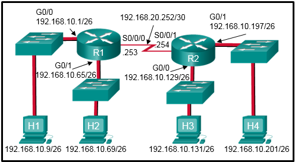
- [x] access-list 5 permit 192.168.10.0 0.0.0.63 & access-list 5 permit 192.168.10.64 0.0.0.63
- [ ] access-list 2 permit host 192.168.10.9 & access-list 2 permit host 192.168.10.69
- [ ] access-list 3 permit 192.168.10.128 0.0.0.63
- [ ] access-list 4 permit 192.168.10.0 0.0.0.255
- [x] access-list 1 permit 192.168.10.0 0.0.0.127

> **Explanation:** The two ACEs of permit 192.168.10.0 0.0.0.63 and permit 192.168.10.64 0.0.0.63 allow access through the router.

## 12. Which two packet filters could a network administrator use on an IPv4 extended ACL? (Choose two.)
---
- [x] Destination UDP Port Number
- [ ] Computer Type
- [ ] Destination MAC Address
- [x] ICMP Message Type
- [ ] Source TCP Hello Address

> **Explanation:** Extended ACLs can filter on source/destination addresses and TCP/UDP port numbers; additional filtering for protocol types is possible.

## 13. What type of ACL offers greater flexibility and control over network access?
---
- [ ] Numbered Standard
- [ ] Named Standard
- [x] Extended
- [ ] Flexible

> **Explanation:** Extended ACLs offer greater flexibility and control over filtering network traffic.

## 14. What is the quickest way to remove a single ACE from a named ACL?
---
- [x] Use the no keyword and the sequence number of the ACE to be removed.
- [ ] Copy the ACL into a text editor, remove the ACE, then copy the ACL back into the router.
- [ ] Create a new ACL with a different number and apply the new ACL to the router interface.
- [ ] Use the no access-list command to remove the entire ACL, then recreate it without the ACE.

> **Explanation:** Named ACL ACEs can be removed using the no command followed by the sequence number.

## 15. Refer to the exhibit. A network administrator is configuring a standard IPv4 ACL. What is the effect after the command no access-list 10 is entered?
---
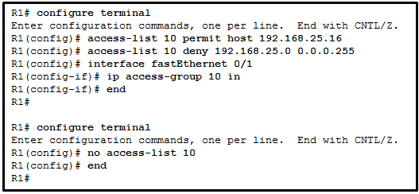
- [x] ACL 10 is removed from the running configuration.
- [ ] ACL 10 is removed from both the running configuration and the interface Fa0/1.
- [ ] ACL 10 is disabled on Fa0/1.
- [ ] ACL 10 will be disabled and removed after R1 restarts.

> **Explanation:** The no access-list command removes the ACL from the running configuration immediately.

## 16. Refer to the exhibit. A network administrator has configured ACL 9 as shown. Users on the 172.31.1.0 /24 network cannot forward traffic through router CiscoVille. What is the most likely cause of the traffic failure?
---
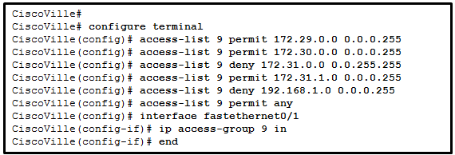
- [ ] The established keyword is not specified.
- [x] The sequence of the ACEs is incorrect.
- [ ] The port number for the traffic has not been identified with the eq keyword.
- [ ] The permit statement specifies an incorrect wildcard mask.

> **Explanation:** The sequence of ACEs needs modification to permit specific traffic from network 172.31.1.0 /24.

## 17. A network administrator needs to configure a standard ACL so that only the workstation of the administrator with the IP address 192.168.15.23 can access the virtual terminal of the main router. Which two configuration commands can achieve the task? (Choose two.)
---
- [x] Router1(config)# access-list 10 permit 192.168.15.23 0.0.0.0
- [ ] Router1(config)# access-list 10 permit 192.168.15.23 0.0.0.255
- [ ] Router1(config)# access-list 10 permit 192.168.15.23 255.255.255.255
- [x] Router1(config)# access-list 10 permit host 192.168.15.23
- [ ] Router1(config)# access-list 10 permit 192.168.15.23 255.255.255.0

> **Explanation:** The wildcard mask 0.0.0.0 or the host keyword allows filtering for a specific IP address.

## 18. Refer to the exhibit. Which command would be used in a standard ACL to allow only devices on the network attached to R2 G0/0 interface to access the networks attached to R1?
---
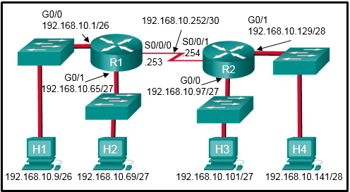
- [ ] access-list 1 permit 192.168.10.128 0.0.0.63
- [x] access-list 1 permit 192.168.10.96 0.0.0.31
- [ ] access-list 1 permit 192.168.10.0 0.0.0.255
- [ ] access-list 1 permit 192.168.10.0 0.0.0.63

> **Explanation:** The correct ACL is access-list 1 permit 192.168.10.96 0.0.0.31 for the R2 G0/0 network.

## 19. A network administrator is writing a standard ACL that will deny any traffic from the 172.16.0.0/16 network, but permit all other traffic. Which two commands should be used? (Choose two.)
---
- [x] Router(config)# access-list 95 deny 172.16.0.0 0.0.255.255
- [x] Router(config)# access-list 95 permit any
- [ ] Router(config)# access-list 95 host 172.16.0.0
- [ ] Router(config)# access-list 95 172.16.0.0 255.255.255.255
- [ ] Router(config)# access-list 95 deny any

> **Explanation:** Use access-list 95 deny 172.16.0.0 0.0.255.255 to deny the 172.16.0.0/16 network and access-list 95 permit any to allow all other traffic.

## 20. Refer to the exhibit. An ACL was configured on R1 with the intention of denying traffic from subnet 172.16.4.0/24 into subnet 172.16.3.0/24. All other traffic into subnet 172.16.3.0/24 should be permitted. This standard ACL was then applied outbound on interface Fa0/0. Which conclusion can be drawn from this configuration?
---
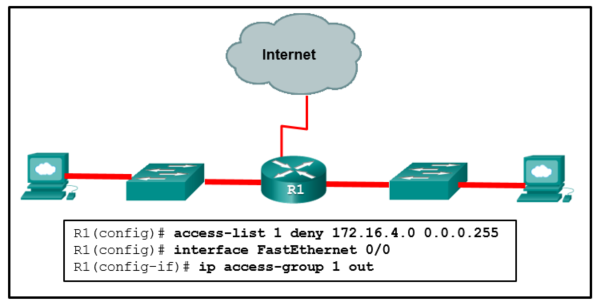
- [ ] The ACL should be applied outbound on all interfaces of R1.
- [ ] The ACL should be applied to the FastEthernet 0/0 interface of R1 inbound to accomplish the requirements.
- [x] All traffic will be blocked, not just traffic from the 172.16.4.0/24 subnet.
- [ ] Only traffic from the 172.16.4.0/24 subnet is blocked, and all other traffic is allowed.
- [ ] An extended ACL must be used in this situation.

> **Explanation:** An implicit deny exists at the end of all ACLs, so the access-list 1 permit any command ensures only 172.16.4.0/24 is blocked.

## 21. Refer to the exhibit. A network administrator needs to add an ACE to the TRAFFIC-CONTROL ACL that will deny IP traffic from the subnet 172.23.16.0/20. Which ACE will meet this requirement?
---
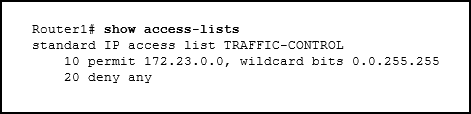
- [ ] 30 deny 172.23.16.0 0.0.15.255
- [ ] 15 deny 172.23.16.0 0.0.15.255
- [x] 5 deny 172.23.16.0 0.0.15.255
- [ ] 5 deny 172.23.16.0 0.0.255.255

> **Explanation:** The router parses ACEs from lowest to highest sequence number, so the entry with 5 deny is needed.

## 22. Refer to the exhibit. A network administrator configures an ACL on the router. Which statement describes the result of the configuration?
---
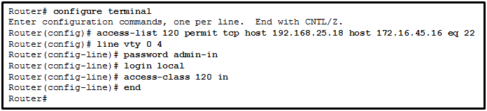
- [x] An SSH connection is allowed from a workstation with IP 172.16.45.16 to a device with IP 192.168.25.18.
- [ ] An SSH connection is allowed from a workstation with IP 192.168.25.18 to a device with IP 172.16.45.16.
- [ ] A Telnet connection is allowed from a workstation with IP 192.168.25.18 to a device with IP 172.16.45.16.
- [ ] A Telnet connection is allowed from a workstation with IP 172.16.45.16 to a device with IP 192.168.25.18.

> **Explanation:** In extended ACLs, the first address is the source IP and the second is the destination. Port 22 is for SSH, while Telnet uses port 23.

## 23. Refer to the exhibit. What can be determined from this output?
---
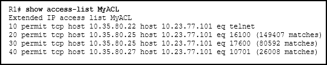
- [ ] The ACL is missing the deny ip any any ACE.
- [ ] The ACL is only monitoring traffic destined for 10.23.77.101 from three specific hosts.
- [ ] Because there are no matches for line 10, the ACL is not working.
- [x] The router has not had any Telnet packets from 10.35.80.22 that are destined for 10.23.77.101.

> **Explanation:** The lack of matches for ACE 10 means that no Telnet packets have matched its conditions.

## 24. Refer to the exhibit. A network administrator wants to permit only host 192.168.1.1 /24 to be able to access the server 192.168.2.1 /24. Which three commands will achieve this using best ACL placement practices? (Choose three.)
---
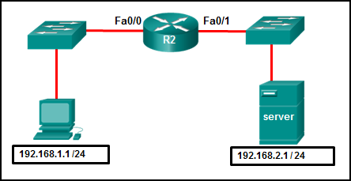
- [x] R2(config)# interface fastethernet 0/0
- [x] R2(config)# access-list 101 permit ip host 192.168.1.1 host 192.168.2.1
- [x] R2(config-if)# ip access-group 101 in
- [ ] R2(config)# access-list 101 permit ip any any
- [ ] R2(config)# access-list 101 permit ip 192.168.1.0 255.255.255.0 192.168.2.0 255.255.255.0
- [ ] R2(config-if)# ip access-group 101 out
- [ ] R2(config)# interface fastethernet 0/1

> **Explanation:** Place the ACL as close to the source of traffic as possible for better traffic control and minimal network overhead.

## 25. Consider the following access list. access-list 100 permit ip host 192.168.10.1 any access-list 100 deny icmp 192.168.10.0 0.0.0.255 any echo access-list 100 permit ip any any Which two actions are taken if the access list is placed inbound on a router Gigabit Ethernet port that has the IP address 192.168.10.254 assigned? (Choose two.)
---
- [ ] Only Layer 3 connections are allowed to be made from the router to any other network device.
- [ ] Devices on the 192.168.10.0/24 network are not allowed to reply to any ping requests.
- [ ] Devices on the 192.168.10.0/24 network can sucessfully ping devices on the 192.168.11.0 network.
- [x] A Telnet or SSH session is allowed from any device on the 192.168.10.0 into the router with this access list assigned.
- [x] Devices on the 192.168.10.0/24 network are allowed to reply to any ping requests.
- [ ] Only the network device assigned the IP address 192.168.10.1 is allowed to access the router.

## 26. Refer to the exhibit. The named ACL “Managers” already exists on the router. What will happen when the network administrator issues the commands that are shown in the exhibit?
---
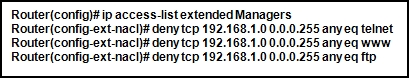
- [x] The commands are added at the end of the existing Managers ACL.
- [ ] The commands overwrite the existing Managers ACL.
- [ ] The commands are added at the beginning of the existing Managers ACL.
- [ ] The network administrator receives an error that states that the ACL already exists.

## 27. In which TCP attack is the cybercriminal attempting to overwhelm a target host with half-open TCP connections?
---
- [ ] port scan attack
- [x] SYN flood attack
- [ ] session hijacking attack
- [ ] reset attack

> **Explanation:** In a TCP SYN flood attack, the attacker sends to the target host a continuous flood of TCP SYN session requests with a spoofed source IP address. The target host responds with a TCP-SYN-ACK to each of the SYN session requests and waits for a TCP ACK that will never arrive. Eventually the target is overwhelmed with half-open TCP connections.

## 28. Which protocol is attacked when a cybercriminal provides an invalid gateway in order to create a man-in-the-middle attack?
---
- [x] DHCP
- [ ] DNS
- [ ] ICMP
- [ ] HTTP or HTTPS
> **Explanation:** A cybercriminal could set up a rogue DHCP server that provides one or more of the following:
>
> - Wrong default gateway that is used to create a man-in-the-middle attack and allow the attacker to intercept data
> - Wrong DNS server that results in the user being sent to a malicious website
> - Invalid default gateway IP address that results in a denial of service attack on the DHCP client

## 29. Refer to the exhibit. An administrator has configured a standard ACL on R1 and applied it to interface serial 0/0/0 in the outbound direction. What happens to traffic leaving interface serial 0/0/0 that does not match the configured ACL statements?
---
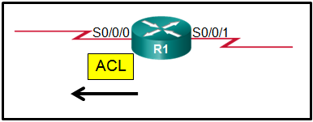
- [x] The traffic is dropped.
- [ ] The source IP address is checked and, if a match is not found, traffic is routed out interface serial 0/0/1.
- [ ] The resulting action is determined by the destination IP address.
- [ ] The resulting action is determined by the destination IP address and port number

> **Explanation:** Any traffic that does not match one of the statements in an ACL has the implicit deny applied to it, which means the traffic is dropped.

## 30. Refer to the exhibit. The Gigabit interfaces on both routers have been configured with subinterface numbers that match the VLAN numbers connected to them. PCs on VLAN 10 should be able to print to the P1 printer on VLAN 12. PCs on VLAN 20 should print to the printers on VLAN 22. What interface and in what direction should you place a standard ACL that allows printing to P1 from data VLAN 10, but stops the PCs on VLAN 20 from using the P1 printer? (Choose two.)
---
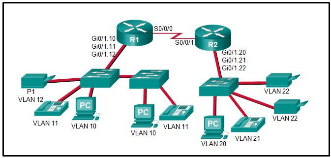
- [ ] inbound
- [ ] R2 S0/0/1
- [x] R1 Gi0/1.12
- [x] outbound
- [ ] R1 S0/0/0
- [ ] R2 Gi0/1.20

>**Explanation:** A standard access list is commonly placed as close to the destination network as possible because access control expressions in a standard ACL do not include information about the destination network.
The destination in this example is printer VLAN 12 which has router R1 Gigabit subinterface 0/1/.12 as its gateway. A sample standard ACL that only allows printing from data VLAN 10 (192.168.10.0/24), for example, and no other VLAN would be as follows:
>
>R1(config)# access-list 1 permit 192.168.10.0 0.0.0.255
>R1(config)# access-list 1 deny any
>R1(config)# interface gigabitethernet 0/1.12
>R1(config-if)# ip access-group 1 out
>

## 31. Which statement describes a characteristic of standard IPv4 ACLs?
---
- [ ] They are configured in the interface configuration mode.
- [ ] They can be configured to filter traffic based on both source IP addresses and source ports.
- [ ] They can be created with a number but not with a name.
- [x] They filter traffic based on source IP addresses only.

> **Explanation:** A standard IPv4 ACL can filter traffic based on source IP addresses only. Unlike an extended ACL, it cannot filter traffic based on Layer 4 ports. However, both standard and extended ACLs can be identified with either a number or a name, and both are configured in global configuration mode.

## 32. What is considered a best practice when configuring ACLs on vty lines?
---
- [x] Place identical restrictions on all vty lines.
- [ ] Remove the vty password since the ACL restricts access to trusted users.
- [ ] Apply the ip access-group command inbound.
- [ ] Use only extended access lists.

## 33. Refer to the exhibit. An administrator first configured an extended ACL as shown by the output of the show access-lists command. The administrator then edited this access-list by issuing the commands below. Router(config)# ip access-list extended 101 Router(config-ext-nacl)# no 20 Router(config-ext-nacl)# 5 permit tcp any any eq 22 Router(config-ext-nacl)# 20 deny udp any any Which two conclusions can be drawn from this new configuration?​ (Choose two.)
---
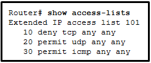
- [ ] TFTP packets will be permitted.​
- [x] Ping packets will be permitted.
- [ ] Telnet packets will be permitted.
- [x] SSH packets will be permitted.
- [ ] All TCP and UDP packets will be denied.​

> **Explanation:** After the editing, the final configuration is as follows:
> - Router# show access-lists
> - Extended IP access list 101
> - 5 permit tcp any any eq ssh
> - 10 deny tcp any any
> - 20 deny udp any any
> - 30 permit icmp any any
> - So, only SSH packets and ICMP packets will be permitted.​

## 34. Which set of access control entries would allow all users on the 192.168.10.0/24 network to access a web server that is located at 172.17.80.1, but would not allow them to use Telnet?
---
- [ ] access-list 103 deny tcp host 192.168.10.0 any eq 23 & access-list 103 permit tcp host 192.168.10.1 eq 80
- [ ] access-list 103 permit tcp 192.168.10.0 0.0.0.255 any eq 80 & access-list 103 deny tcp 192.168.10.0 0.0.0.255 any eq 23
- [ ] access-list 103 permit 192.168.10.0 0.0.0.255 host 172.17.80.1 & access-list 103 deny tcp 192.168.10.0 0.0.0.255 any eq telnet​​
- [x] access-list 103 permit tcp 192.168.10.0 0.0.0.255 host 172.17.80.1 eq 80 & access-list 103 deny tcp ​192.168.10.0 0.0.0.255 any eq 23

> **Explanation:** For an extended ACL to meet these requirements the following need to be included in the access control entries:
> - identification number in the range 100-199 or 2000-2699
> - permit or deny parameter
> - protocol
> - source address and wildcard
> - destination address and wildcard
> - port number or name

## 35. What is the term used to describe a mechanism that takes advantage of a vulnerability?
---
- [ ] mitigation
- [x] exploit
- [ ] vulnerability
- [ ] threat

## 36. Refer to the exhibit. The network administrator has an IP address of 192.168.11.10 and needs access to manage R1. What is the best ACL type and placement to use in this situation?
---

- [ ] extended ACL outbound on R2 WAN interface towards the internet
- [x] standard ACL inbound on R1 vty lines
- [ ] extended ACLs inbound on R1 G0/0 and G0/1
- [ ] extended ACL outbound on R2 S0/0/1

## 37. A technician is tasked with using ACLs to secure a router. When would the technician use the any configuration option or command?
---
- [ ] to add a text entry for documentation purposes
- [ ] to generate and send an informational message whenever the ACE is matched
- [x] to identify any IP address
- [ ] to identify one specific IP address

## 38. Which statement accurately characterizes the evolution of threats to network security?
---
- [ ] Internet architects planned for network security from the beginning.
- [ ] Early Internet users often engaged in activities that would harm other users.
- [x] Internal threats can cause even greater damage than external threats.
- [ ] Threats have become less sophisticated while the technical knowledge needed by an attacker has grown.

## 39. A user receives a phone call from a person who claims to represent IT services and then asks that user for confirmation of username and password for auditing purposes. Which security threat does this phone call represent?
---
- [ ] spam
- [x] social engineering
- [ ] DDoS
- [ ] anonymous keylogging

## 40. In what way are zombies used in security attacks?
---
- [ ] They target specific individuals to gain corporate or personal information.
- [ ] They probe a group of machines for open ports to learn which services are running.
- [ ] They are maliciously formed code segments used to replace legitimate applications.
- [x] They are infected machines that carry out a DDoS attack.

## 41. Which attack involves threat actors positioning themselves between a source and destination with the intent of transparently monitoring, capturing, and controlling the communication?
---
- [x] man-in-the-middle attack
- [ ] SYN flood attack
- [ ] DoS attack
- [ ] ICMP attack

## 42. Which two keywords can be used in an access control list to replace a wildcard mask or address and wildcard mask pair? (Choose two.)
---
- [x] host
- [ ] most
- [ ] gt
- [ ] some
- [x] any
- [ ] all

## 43. Which statement describes a difference between the operation of inbound and outbound ACLs?
---
- [x] Inbound ACLs are processed before the packets are routed while outbound ACLs are processed after the routing is completed.
- [ ] In contrast to outbound ALCs, inbound ACLs can be used to filter packets with multiple criteria.
- [ ] On a network interface, more than one inbound ACL can be configured but only one outbound ACL can be configured.
- [ ] Inbound ACLs can be used in both routers and switches but outbound ACLs can be used only on routers.

## 44. What effect would the Router1(config-ext-nacl)# permit tcp 172.16.4.0 0.0.0.255 any eq www command have when implemented inbound on the f0/0 interface?
---
- [ ] All TCP traffic is permitted, and all other traffic is denied.
- [x] Traffic originating from 172.16.4.0/24 is permitted to all TCP port 80 destinations.
- [ ] All traffic from 172.16.4.0/24 is permitted anywhere on any port.
- [ ] The command is rejected by the router because it is incomplete.

## 45. Which ACE will permit a packet that originates from any network and is destined for a web server at 192.168.1.1?
---
- [x] access-list 101 permit tcp any host 192.168.1.1 eq 80
- [ ] access-list 101 permit tcp host 192.168.1.1 eq 80 any
- [ ] access-list 101 permit tcp host 192.168.1.1 any eq 80
- [ ] access-list 101 permit tcp any eq 80 host 192.168.1.1

## 46. Refer to the exhibit. A new network policy requires an ACL denying FTP and Telnet access to a Corp file server from all interns. The address of the file server is 172.16.1.15 and all interns are assigned addresses in the 172.18.200.0/24 network. After implementing the ACL, no one in the Corp network can access any of the servers. What is the problem?
---
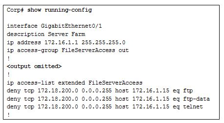
- [ ] Inbound ACLs must be routed before they are processed.
- [x] The ACL is implicitly denying access to all the servers.
- [ ] Named ACLs require the use of port numbers.
- [ ] The ACL is applied to the interface using the wrong direction.

## 47. A technician is tasked with using ACLs to secure a router. When would the technician use the access-class 20 in configuration option or command?
---
- [x] to secure administrative access to the router
- [ ] to remove an ACL from an interface
- [ ] to remove a configured ACL
- [ ] to apply a standard ACL to an interface

## 48. What is the term used to describe the same pre-shared key or secret key, known by both the sender and receiver to encrypt and decrypt data?
---
- [x] symmetric encryption algorithm
- [ ] data integrity
- [ ] exploit
- [ ] risk

## 49. Refer to the exhibit. Internet privileges for an employee have been revoked because of abuse but the employee still needs access to company resources. What is the best ACL type and placement to use in this situation?
---
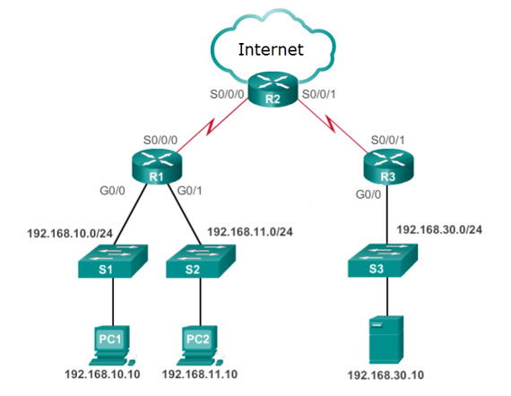
- [ ] standard ACL inbound on R2 WAN interface connecting to the internet
- [x] standard ACL outbound on R2 WAN interface towards the internet
- [ ] standard ACL inbound on R1 G0/0
- [ ] standard ACL outbound on R1 G0/0

## 50. Refer to the exhibit. The student on the H1 computer continues to launch an extended ping with expanded packets at the student on the H2 computer. The school network administrator wants to stop this behavior, but still allow both students access to web-based computer assignments. What would be the best plan for the network administrator?
---
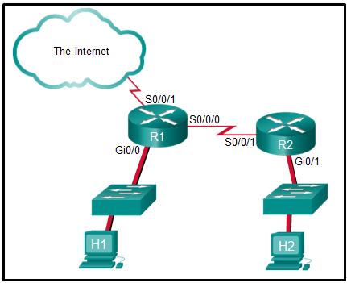

CCNA 3 v7 Modules 3 – 5: Network Security Exam Answers 42

- [ ] Apply an inbound standard ACL on R1 Gi0/0.
- [ ] Apply an inbound extended ACL on R2 Gi0/1.
- [ ] Apply an outbound extended ACL on R1 S0/0/1.
- [x] Apply an inbound extended ACL on R1 Gi0/0.
- [ ] Apply an outbound standard ACL on R2 S0/0/1

## 51. A technician is tasked with using ACLs to secure a router. When would the technician use the ‘ip access-group 101 in’ configuration option or command?
---
- [x] to apply an extended ACL to an interface
- [ ]  secure management traffic into the router
- [ ] to secure administrative access to the router
- [ ] to display all restricted traffic

## 52. In which type of attack is falsified information used to redirect users to malicious Internet sites?
---
- [ ] DNS amplification and reflection
- [ ] ARP cache poisoning
- [x] DNS cache poisoning
- [ ] domain generation

## 53. What is a feature of an IPS?
---
- [x] It can stop malicious packets.
- [ ] It is deployed in offline mode.
- [ ] It has no impact on latency.
- [ ] It is primarily focused on identifying possible incidents.

## 54. What is the term used to describe a potential danger to a company’s assets, data, or network functionality?
---
- [ ] vulnerability
- [x] threat
- [ ] asset
- [ ] exploit

## 55. Refer to the exhibit. Network 192.168.30.0/24 contains all of the company servers. Policy dictates that traffic from the servers to both networks 192.168.10.0 and 192.168.11.0 be limited to replies for original requests. What is the best ACL type and placement to use in this situation?
---

- [x] extended ACL inbound on R3 G0/0
- [ ] extended ACL inbound on R1 G0/0
- [ ] standard ACL inbound on R1 G0/1
- [ ] standard ACL inbound on R1 vty lines

## 56. What does the CLI prompt change to after entering the command ip access-list standard aaa from global configuration mode?
---
- [ ] Router(config-line)#
- [x] Router(config-std-nacl)#
- [ ] Router(config)#
- [ ] (config-router)#
- [ ] Router(config-if)#

## 57. Refer to the exhibit. Many employees are wasting company time accessing social media on their work computers. The company wants to stop this access. What is the best ACL type and placement to use in this situation?
---
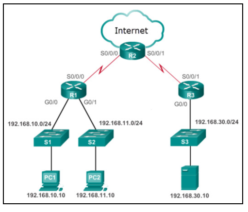

- [ ] extended ACL outbound on R2 WAN interface towards the internet
- [ ] standard ACL outbound on R2 WAN interface towards the internet
- [ ] standard ACL outbound on R2 S0/0/0
- [x] extended ACLs inbound on R1 G0/0 and G0/1

## 58. A technician is tasked with using ACLs to secure a router. When would the technician use the 40 deny host 192.168.23.8 configuration option or command?
---
- [ ] to remove all ACLs from the router
- [x] to create an entry in a numbered ACL
- [ ] to apply an ACL to all router interfaces
- [ ] to secure administrative access to the router

## 59. What is the best description of Trojan horse malware?
---
- [ ] It is malware that can only be distributed over the Internet.
- [x] It appears as useful software but hides malicious code.
- [ ] It is software that causes annoying but not fatal computer problems.
- [ ] It is the most easily detected form of malware.

## 60. What wild card mask will match networks 172.16.0.0 through 172.19.0.0?
---
- [ ] 0.0.3.255
- [ ] 0.252.255.255
- [x] 0.3.255.255
- [ ] 0.0.255.255

## 61. What is the term used to describe gray hat hackers who publicly protest organizations or governments by posting articles, videos, leaking sensitive information, and performing network attacks?
---
- [ ] white hat hackers
- [ ] grey hat hackers
- [x] hacktivists
- [ ] state-sponsored hacker

## 62. A technician is tasked with using ACLs to secure a router. When would the technician use the no ip access-list 101 configuration option or command?
---
- [ ] to apply an ACL to all router interfaces
- [ ] to secure administrative access to the router
- [ ] to remove all ACLs from the router
- [x] to remove a configured ACL

## 63. What is the term used to describe unethical criminals who compromise computer and network security for personal gain, or for malicious reasons?
---
- [ ] hacktivists
- [ ] vulnerability broker
- [x] black hat hackers
- [ ] script kiddies

## 64. What is the term used to describe a guarantee that the message is not a forgery and does actually come from whom it states?
---
- [x] origin authentication
- [ ] mitigation
- [ ] exploit
- [ ] data non-repudiation

## 65. A technician is tasked with using ACLs to secure a router. When would the technician use the ip access-group 101 in configuration option or command?
---
- [ ] to secure administrative access to the router
- [x] to apply an extended ACL to an interface
- [ ] to display all restricted traffic
- [ ] to secure management traffic into the router

## 66. A technician is tasked with using ACLs to secure a router. When would the technician use the remark configuration option or command?
---
- [ ] to generate and send an informational message whenever the ACE is matched
- [x] to add a text entry for documentation purposes
- [ ] to identify one specific IP address
- [ ] to restrict specific traffic access through an interface

## 67. Refer to the exhibit. The company CEO demands that one ACL be created to permit email traffic to the internet and deny FTP access. What is the best ACL type and placement to use in this situation?
---
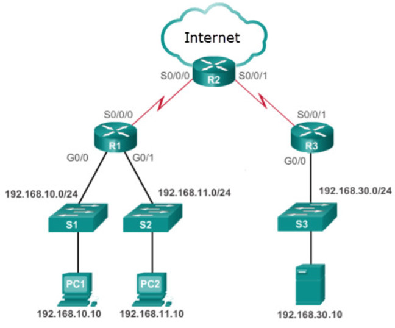
- [x] extended ACL outbound on R2 WAN interface towards the internet
- [ ] standard ACL outbound on R2 S0/0/0
- [ ] extended ACL inbound on R2 S0/0/0
- [ ] standard ACL inbound on R2 WAN interface connecting to the internet

## 68. A technician is tasked with using ACLs to secure a router. When would the technician use the established configuration option or command?
---
- [ ] to add a text entry for documentation purposes
- [ ] to display all restricted traffic
- [ ] to allow specified traffic through an interface
- [x] to allow returning reply traffic to enter the internal network

## 69. A technician is tasked with using ACLs to secure a router. When would the technician use the deny configuration option or command?
---
- [ ] to identify one specific IP address
- [ ] to display all restricted traffic
- [x] to restrict specific traffic access through an interface
- [ ] to generate and send an informational message whenever the ACE is matched

## 70. Refer to the exhibit. Only authorized remote users are allowed remote access to the company server 192.168.30.10. What is the best ACL type and placement to use in this situation?
---

- [ ] extended ACLs inbound on R1 G0/0 and G0/1
- [ ] extended ACL outbound on R2 WAN interface towards the internet
- [ ] extended ACL inbound on R2 S0/0/0
- [x] extended ACL inbound on R2 WAN interface connected to the internet

## 71. Refer to the exhibit. Employees on 192.168.11.0/24 work on critically sensitive information and are not allowed access off their network. What is the best ACL type and placement to use in this situation?
---

- [ ] standard ACL inbound on R1 vty lines
- [ ] extended ACL inbound on R1 G0/0
- [x] standard ACL inbound on R1 G0/1
- [ ] extended ACL inbound on R3 S0/0/1

## 72. A technician is tasked with using ACLs to secure a router. When would the technician use the host configuration option or command?
---
- [ ] to add a text entry for documentation purposes
- [ ] to generate and send an informational message whenever the ACE is matched
- [ ] to identify any IP address
- [x] to identify one specific IP address

## 73. What commonly motivates cybercriminals to attack networks as compared to hacktivists or state-sponsored hackers?
---
- [x] financial gain
- [ ] political reasons
- [ ] fame seeking
- [ ] status among peers

## 74. Refer to the exhibit. The company has provided IP phones to employees on the 192.168.10.0/24 network and the voice traffic will need priority over data traffic. What is the best ACL type and placement to use in this situation?
---

- [x] extended ACL inbound on R1 G0/0
- [ ] extended ACL outbound on R2 WAN interface towards the internet
- [ ] extended ACL outbound on R2 S0/0/1
- [ ] extended ACLs inbound on R1 G0/0 and G0/1

## 75. What is a function of OSPF hello packets?
---
- [ ] to send specifically requested link-state records
- [x] to discover neighbors and build adjacencies between them
- [ ] to ensure database synchronization between routers
- [ ] to request specific link-state records from neighbor routers

## 76. Which OSPF packet contains the different types of link-state advertisements?
---
- [ ] hello
- [ ] DBD
- [ ] LSR
- [x] LSU
- [ ] LSAck

## 1. Which three statements describe features of the OSPF topology table? (Choose three.)
---
- [x] It is a link-state database that represents the network topology.
- [ ] Its contents are the result of running the SPF algorithm.
- [x] When converged, all routers in an area have identical topology tables.
- [ ] The topology table contains feasible successor routes.
- [x] The table can be viewed via the show ip ospf database command.
- [ ] After convergence, the table only contains the lowest cost route entries for all known networks.

## 1. What does an OSPF area contain?
---
- [ ] routers that share the same router ID
- [ ] routers whose SPF trees are identical
- [x] routers that have the same link-state information in their LSDBs
- [ ] routers that share the same process ID

## 5. What is used to facilitate hierarchical routing in OSPF?
---
- [x] the use of multiple areas
- [ ] frequent SPF calculations
- [ ] autosummarization
- [ ] the election of designated routers

## 6. Which OSPF data structure is identical on all OSPF routers that share the same area?
---
- [ ] forwarding database
- [x] link-state database
- [ ] adjacency database
- [ ] routing table

## 7. WWhich step does an OSPF-enabled router take immediately after establishing an adjacency with another router?
---
- [ ] builds the topology table
- [x] link-state advertisements
- [ ] chooses the best path
- [ ] executes the SPF algorithm

## 8. A network engineer has manually configured the hello interval to 15 seconds on an interface of a router that is running OSPFv2. By default, how will the dead interval on the interface be affected?
---
- [ ] The dead interval will not change from the default value.
- [ ] The dead interval will now be 30 seconds.
- [x] The dead interval will now be 60 seconds.
- [ ] The dead interval will now be 15 seconds.

## 9. Refer to the exhibit. A network administrator has configured the OSPF timers to the values that are shown in the graphic. What is the result of having those manually configured timers?
---
- [ ] R1 automatically adjusts its own timers to match the R2 timers.
- [x] The R1 dead timer expires between hello packets from R2.
- [ ] The hello timer on R2 expires every ten seconds.
- [ ] The neighbor adjacency has formed.

## 10. To establish a neighbor adjacency two OSPF routers will exchange hello packets. Which two values in the hello packets must match on both routers? (Choose two.)
---
- [x] dead interval 
- [ ] router priority
- [ ] list of neighbors
- [ ] router ID
- [x] hello interval

## 11. What is the default router priority value for all Cisco OSPF routers?
---
- [ ] 0
- [x] 1
- [ ] 10
- [ ] 255

## 12. Which type of OSPFv2 packet contains an abbreviated list of the LSDB of a sending router and is used by receiving routers to check against the local LSDB?
---
- [x] database description
- [ ] link-state update
- [ ] link-state request
- [ ] link-state acknowledgmen

## 13. In an OSPF network when are DR and BDR elections required?
---
- [ ] when the two adjacent neighbors are interconnected over a point-to-point link
- [ ] when all the routers in an OSPF area cannot form adjacencies
- [x] when the routers are interconnected over a common Ethernet network
- [ ] when the two adjacent neighbors are in two different networks

## 14. When an OSPF network is converged and no network topology change has been detected by a router, how often will LSU packets be sent to neighboring routers?
---
- [ ] every 5 minutes
- [ ] every 10 minutes
- [x] every 30 minutes
- [ ] every 60 minutes

## 15. What will an OSPF router prefer to use first as a router ID?
---
- [ ] a loopback interface that is configured with the highest IP address on the router
- [x] any IP address that is configured using the router-id command
- [ ] the highest active interface IP that is configured on the router
- [ ] the highest active interface that participates in the routing process because of a specifically configured network statement

## 16. What are the two purposes of an OSPF router ID? (Choose two.)
---
- [x] to uniquely identify the router within the OSPF domain
- [x] to facilitate router participation in the election of the designated router
- [ ] to enable the SPF algorithm to determine the lowest cost path to remote networks
- [ ] to facilitate the establishment of network convergence
- [ ] to facilitate the transition of the OSPF neighbor state to Full

## 17. Refer to the exhibit. If no router ID was manually configured, what would router Branch1 use as its OSPF router ID?
---
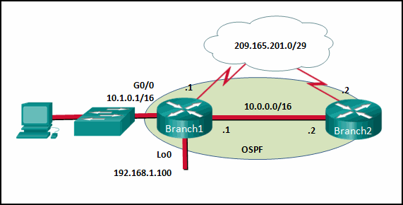

- [ ] 10.0.0.1
- [ ] 10.1.0.1
- [x] 192.168.1.100
- [ ] 209.165.201.1

## 18. A network technician issues the following commands when configuring a router: \n R1(config)# router ospf 11 \n R1(config-router)# network 10.10.10.0 0.0.0.255 area 0 \n What does the number 11 represent?
---
- [x] the OSPF process ID on R1
- [ ] the cost of the link to R1
- [ ] the autonomous system number to which R1 belongs
- [ ] the administrative distance that is manually assigned to R1
- [ ] the area number where R1 is located

## 19. An OSPF router has three directly connected networks; 172.16.0.0/16, 172.16.1.0/16, and 172.16.2.0/16. Which OSPF network command would advertise only the 172.16.1.0 network to neighbors?
---
- [ ] router(config-router)# network 172.16.1.0 0.0.255.255 area 0
- [ ] router(config-router)# network 172.16.0.0 0.0.15.255 area 0
- [x] router(config-router)# network 172.16.1.0 255.255.255.0 area 0
- [ ] router(config-router)# network 172.16.1.0 0.0.0.0 area 0

## 20. Refer to the exhibit. Which three statements describe the results of the OSPF election process of the topology that is shown in the exhibit? (Choose three.)
---
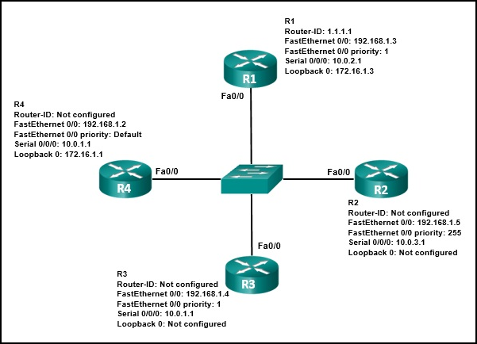

- [x] R3 will be elected BDR.
- [ ] The R4 FastEthernet 0/0 priority is 128.
- [x] The R4 router ID is 172.16.1.1.
- [ ] R1 will be elected BDR.
- [ ] The router ID on R2 is the loopback interface.
- [x] R2 will be elected DR.

## 21. Refer to the exhibit. If the switch reboots and all routers have to re-establish OSPF adjacencies, which routers will become the new DR and BDR?
---
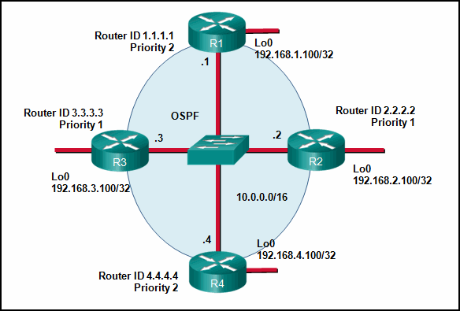

- [x] Router R4 will become the DR and router R1 will become the BDR.
- [ ] Router R2 will become the DR and router R3 will become the BDR.
- [ ] Router R1 will become the DR and router R2 will become the BDR.
- [ ] Router R4 will become the DR and router R3 will become the BDR.

## 22. By default, what is the OSPF cost for any link with a bandwidth of 100 Mb/s or greater?
---
- [ ] 100000000
- [ ] 10000
- [x] 1
- [ ] 100

## 23. Refer to the exhibit. What is the OSPF cost to reach the router A LAN 172.16.1.0/24 from B?
---
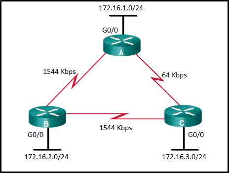
- [ ] 782
- [ ] 74
- [ ] 128
- [x] 65

## 24. Refer to the exhibit. On which router or routers would a default route be statically configured in a corporate environment that uses single area OSPF as the routing protocol?
---
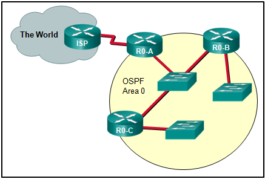
- [x] R0-A
- [ ] ISP, R0-A, R0-B, and R0-C
- [ ] ISP
- [ ] R0-B and R0-C
- [ ] ISP and R0-A
- [ ] R0-A, R0-B, and R0-C

## 25. What command would be used to determine if a routing protocol-initiated relationship had been made with an adjacent router?
---
- [ ] ping
- [x] show ip ospf neighbor
- [ ] show ip interface brief
- [ ] show ip protocols

## 26. Refer to the exhibit. Which command did an administrator issue to produce this output?
---
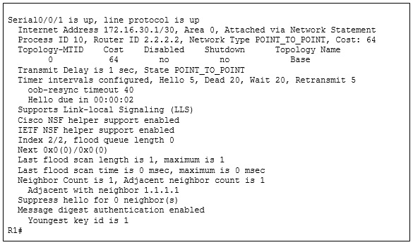
- [x] R1# show ip ospf interface serial0/0/1
- [ ] R1# show ip route ospf
- [ ] R1# show ip ospf
- [ ] R1# show ip ospf neighbo

## 27. Which command is used to verify that OSPF is enabled and also provides a list of the networks that are being advertised by the network?​
---
- [ ] how ip interface brief
- [ ] show ip ospf interface
- [x] show ip protocols
- [ ] show ip route ospf

## 28. Refer to the exhibit. A network administrator has configured OSPFv2 on the two Cisco routers but PC1 is unable to connect to PC2. What is the most likely problem?
---
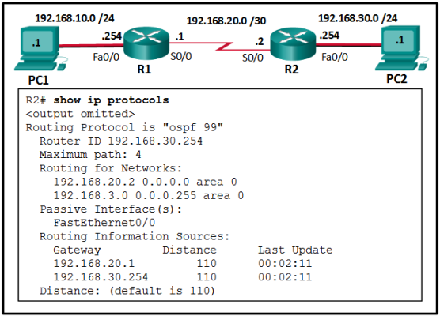
- [x] Interface Fa0/0 has not been activated for OSPFv2 on router R2.
- [ ] Interface Fa0/0 is configured as a passive-interface on router R2.
- [ ] Interface S0/0 is configured as a passive-interface on router R2.
- [ ] Interface s0/0 has not been activated for OSPFv2 on router R2.

## 29. What is the recommended Cisco best practice for configuring an OSPF-enabled router so that each router can be easily identified when troubleshooting routing issues?
---
- [x] Configure a value using the router-id command.
- [ ] Use the highest active interface IP address that is configured on the router.
- [ ] Use a loopback interface configured with the highest IP address on the router.
- [ ] Use the highest IP address assigned to an active interface participating in the routing process.

## 30. Which step in the link-state routing process is described by a router running an algorithm to determine the best path to each destination?
---
- [ ] load balancing equal-cost paths
- [ ] declaring a neighbor to be inaccessible
- [ ] choosing the best route
- [x] executing the SPF algorithm

## 31. An administrator is configuring single-area OSPF on a router. One of the networks that must be advertised is 192.168.223.0 255.255.254.0. What wildcard mask would the administrator use in the OSPF network statement?
---
- [x] 0.0.1.255
- [ ] 0.0.7.255
- [ ] 0.0.15.255
- [ ] 0.0.31.255

## 32. What is the format of the router ID on an OSPF-enabled router?
---
- [ ] a unique router host name that is configured on the router
- [ ] a unique phrase with no more than 16 characters
- [x] a 32-bit number formatted like an IPv4 address
- [ ] an 8-bit number with a decimal value between 0 and 255
- [ ] a character string with no space

## 34. After modifying the router ID on an OSPF router, what is the preferred method to make the new router ID effective?
---
- [ ] HQ# copy running-config startup-config
- [ ] HQ# resume
- [ ] HQ# clear ip route *
- [x] HQ# clear ip ospf process

## 35. In an OSPFv2 configuration, what is the effect of entering the command network 192.168.1.1 0.0.0.0 area 0 ?
---
- [ ] It allows all 192.168.1.0 networks to be advertised.
- [x] It tells the router which interface to turn on for the OSPF routing process.
- [ ] It changes the router ID of the router to 192.168.1.1.
- [ ] It enables OSPF on all interfaces on the router.

## 36. What is the reason for a network engineer to alter the default reference bandwidth parameter when configuring OSPF?
---
- [ ] to force that specific link to be used in the destination route
- [x] to more accurately reflect the cost of links greater than 100 Mb/s
- [ ] to enable the link for OSPF routing
- [ ] to increase the speed of the link

## 37. Open the PT Activity. Perform the tasks in the activity instructions and then answer the question. Which task has to be performed on Router 1 for it to establish an OSPF adjacency with Router 2?
---
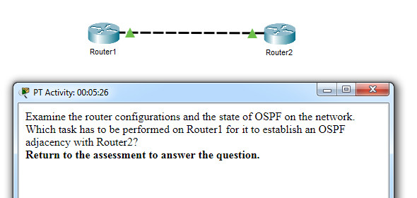

- [ ] Issue the clear ip ospf process command.
- [x] Change the subnet mask of interface FastEthernet 0/0 to 255.255.255.0.
- [ ] Remove the passive interface command from interface FastEthernet 0/0.
- [ ] Add the network 10.0.1.0 0.0.0.255 area 0 command to the OSPF process.

## 38. Match the description to the term. (Not all options are used.)
---
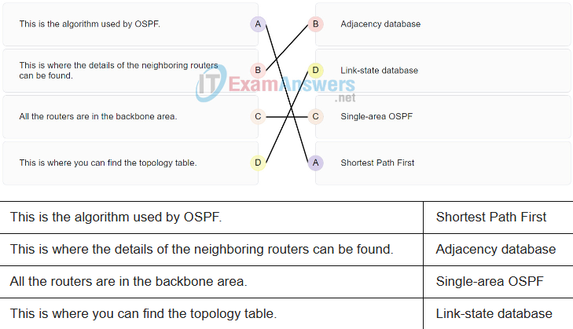

- [x] o
- [ ] x
- [ ] x
- [ ] x

## 39. What is a benefit of multiarea OSPF routing?
---
- [x] Topology changes in one area do not cause SPF recalculations in other areas.
- [ ] Routers in all areas share the same link-state database and have a complete picture of the entire network.
- [ ] A backbone area is not required.
- [ ] Automatic route summarization occurs by default between areas.

## 40. Match the OSPF state with the order in which it occurs. (Not all options are used.)
---
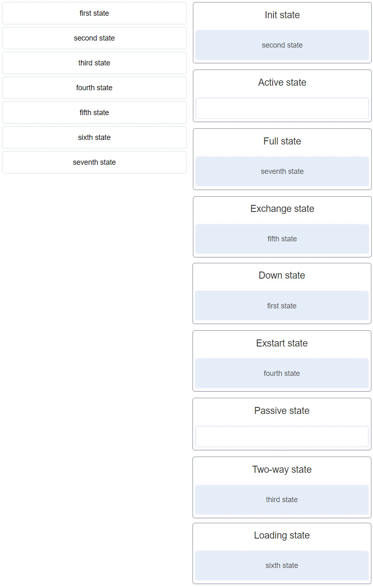

- [x] o
- [ ] x
- [ ] x
- [ ] x

## 41. What indicates to a link-state router that a neighbor is unreachable?
---
- [x] if the router no longer receives hello packets
- [ ] if the router receives an update with a hop count of 16
- [ ] if the router receives an LSP with previously learned information
- [ ] if the router no longer receives routing updates

## 42. Which three OSPF states are involved when two routers are forming an adjacency? (Choose three.)
---
- [ ] Exchange
- [x] Init
- [ ] ExStart
- [x] Two-way
- [ ] Loading
- [x] Down

## 43. Refer to the exhibit. Suppose that routers B, C, and D have a default priority, and router A has a priority 0. Which conclusion can be drawn from the DR/BDR election process?​
---
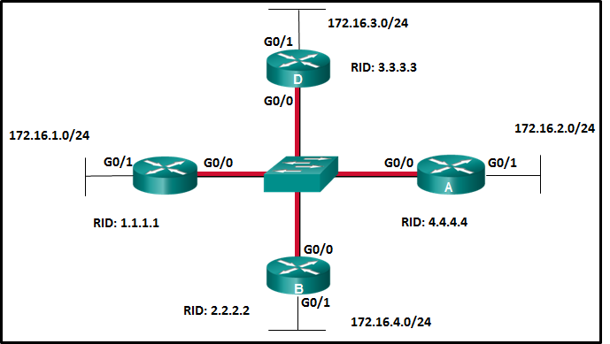

- [ ] If the priority of router C is changed to 255, then it will become the DR.
- [ ] Router A will become the DR and router D will become the BDR.​
- [x] If the DR fails, the new DR will be router B.
- [ ] If a new router with a higher priority is added to this network, it will become the DR.

## 44. An administrator is configuring single-area OSPF on a router. One of the networks that must be advertised is 64.102.0.0 255.255.255.128. What wildcard mask would the administrator use in the OSPF network statement?
---
- [ ] 0.0.31.255
- [ ] 0.0.0.63
- [ ] 0.0.63.255
- [x] 0.0.0.127

## 45. Which command will a network engineer issue to verify the configured hello and dead timer intervals on a point-to-point WAN link between two routers that are running OSPFv2?
---
- [ ] show ipv6 ospf interface serial 0/0/0
- [ ] show ip ospf neighbor
- [ ] show ip ospf interface fastethernet 0/1
- [x] show ip ospf interface serial 0/0/0

## 46. An administrator is configuring single-area OSPF on a router. One of the networks that must be advertised is 128.107.0.0 255.255.255.192. What wildcard mask would the administrator use in the OSPF network statement?
---
- [ ] 0.0.63.255
- [x] 0.0.0.63
- [ ] 0.0.0.3
- [ ] 0.0.0.7

## 47. Match each OSPF packet type to how it is used by a router. (Not all options are used.)
---
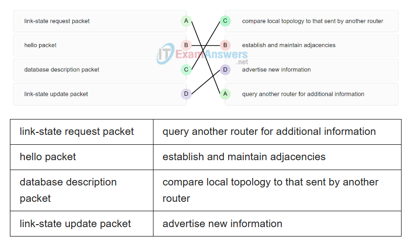

- [x] o
- [ ] x
- [ ] x
- [ ] x

## 48. An administrator is configuring single-area OSPF on a router. One of the networks that must be advertised is 192.168.181.0 255.255.254.0. What wildcard mask would the administrator use in the OSPF network statement?
---
- [ ] .0.63.255
- [ ] 0.0.15.255
- [x] 0.0.1.255
- [ ] 0.0.31.255

## 49. An administrator is configuring single-area OSPF on a router. One of the networks that must be advertised is 198.19.0.0 255.255.252.0. What wildcard mask would the administrator use in the OSPF network statement?
---
- [ ] 0.0.63.255
- [x] 0.0.3.255
- [ ] 0.0.31.255
- [ ] 0.0.0.255

## 50. An administrator is configuring single-area OSPF on a router. One of the networks that must be advertised is 128.107.0.0 255.255.252.0. What wildcard mask would the administrator use in the OSPF network statement?
---
- [x] 0.0.3.255
- [ ] 0.0.0.7
- [ ] 0.0.0.3
- [ ] 0.0.63.255

## 51. Which step in the link-state routing process is described by a router flooding link-state and cost information about each directly connected link?
---
- [ ] building the topology table
- [ ] selecting the router ID
- [x] exchanging link-state advertisements
- [ ] injecting the default route

## 52. Which step in the link-state routing process is described by a router sending Hello packets out all of the OSPF-enabled interfaces?
---
- [ ] electing the designated router
- [x] establishing neighbor adjacencies
- [ ] injecting the default route
- [ ] exchanging link-state advertisements

## 53. An administrator is configuring single-area OSPF on a router. One of the networks that must be advertised is 64.100.0.0 255.255.255.0. What wildcard mask would the administrator use in the OSPF network statement?
---
- [ ] 0.0.0.31
- [x] 0.0.0.255
- [ ] 0.0.0.63
- [ ] 0.0.0.127

## 54. Which step in the link-state routing process is described by a router inserting best paths into the routing table?
---
- [ ] declaring a neighbor to be inaccessible
- [ ] executing the SPF algorithm
- [ ] load balancing equal-cost paths
- [x] choosing the best route

## 55. What type of address is 64.101.198.197?
---
- [x] public
- [ ] private

## 56. An OSPF router has three directly connected networks; 172.16.0.0/24, 172.16.1.0/24, and 172.16.2.0/24. Which OSPF network command would advertise only the 172.16.1.0 network to neighbors?
---
- [ ] router(config-router)# network 172.16.1.0 0.0.255.255 area 0
- [ ] router(config-router)# network 172.16.0.0 0.0.15.255 area 0
- [x] router(config-router)# network 172.16.1.0 0.0.0.255 area 0
- [ ] router(config-router)# network 172.16.1.0 0.0.0.0 area 0

## 57. Which step in the link-state routing process is described by a router building a link-state database based on received LSAs?
---
- [ ] selecting the router ID
- [ ] declaring a neighbor to be inaccessible
- [ ] executing the SPF algorithm
- [x] building the topology table